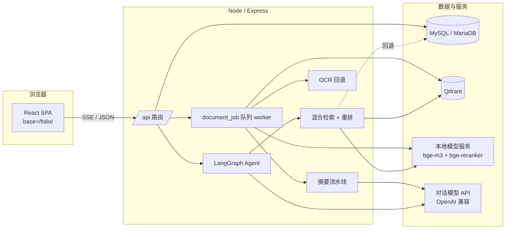

# Folio · 个人知识库

Folio 是一个**带本地 RAG 的个人知识库**：把散落的资料（PDF / Word / Markdown / HTML / CSV / TXT / 扫描件 / 网页 / 粘贴文本）导入后，自动解析、分块、建立向量与词法索引；随后可以组织、检索、基于资料问答，并把有价值的回答沉淀成自己的笔记。**每条回答都带来源，可点击回到原文核对。**

设计取向是「**能本地跑的尽量本地跑**」：Embedding 与重排可完全跑在本机 CPU 上，只有对话模型（以及可选的视觉模型 OCR）需要外部 API。向量库 Qdrant、重排、Agent、OCR 都是**可降级**的，任一环节缺失都能回退到更基础的检索方式。

---

## 目录

- [功能特性](#功能特性)
- [技术栈](#技术栈)
- [系统架构](#系统架构)
- [核心实现](#核心实现)
- [API 概览](#api-概览)
- [数据模型](#数据模型)
- [目录结构](#目录结构)
- [快速开始](#快速开始)
- [配置说明](#配置说明)
- [运行脚本](#运行脚本)
- [部署（AutoDL）](#部署autodl)
- [安全与注意事项](#安全与注意事项)

---

## 功能特性

### 资料管理
- **多文件并行上传**：每个文件独立进度、SHA-256 去重、按扩展名与 magic bytes 双重校验类型。
- **多种来源**：本地文件、直接粘贴文本、导入公开网页（保留来源地址，进入同一解析/分块/索引流程）。
- **解析支持**：PDF（按页提取）、DOCX、Markdown、HTML、CSV、TXT。
- **扫描件 OCR**：PDF 无文字层时自动判定为扫描件并 OCR（本机 `tesseract`，或 `OCR_MODEL` 指定的视觉模型）。
- **预览 / 下载 / 删除 / 失败重试**：失败任务可重试解析或重新入队 Embedding。

### 组织与检索
- **项目（Collection）**：类似文件夹，把多篇资料组成长期工作范围，同时作为问答范围；支持按当前搜索条件创建自动更新的**智能项目**。
- **标签（Tag）**：属性与筛选，支持批量打标。
- **统一搜索**：一次搜索覆盖资料标题、正文分块、笔记、历史问答消息，按类型分组并给出高亮片段。
- **相关文档**：基于向量近邻推荐同一知识库内的相关文档。
- **筛选与排序**：关键词、标签、项目、类型、状态筛选，最近导入 / 标题 / 文件大小排序；移动端自动切换为卡片列表。

### 笔记与版本
- **划线笔记**：对文档或具体分块记笔记（手写 / 摘录 / 由 AI 回答保存），笔记可被检索，并与引用来源放在一起。
- **文档版本**：上传新版本前自动保留旧文件与解析分块，可查看历史并恢复；恢复时当前内容也会保存成新版本。

### AI 摘要
- 按需为单篇文档生成**层级摘要**（分段摘要 → 汇总），缓存并做过期判断（`content_version`），用于快速回忆与多文档任务的全局信息。
- 长文在 Agent 需要整篇理解时进入后台生成，期间不会用开头片段冒充全文概要。

### 问答（Agentic RAG）
- **Agent 工具图**：Agent 可模糊查找资料、列出项目/标签/项目资料、读取覆盖全文的分层概要，并继续检索原文核对结论。
- **检索范围**：全库 / 项目 / 指定资料。
- **SSE 流式输出**：逐字返回，支持**重新生成**、stop 打断。
- **引用与来源**：回答内 `[n]` 引用可点击，弹出原文查看器（PDF 定位到页并高亮文本，其他类型定位到分块）。
- **多轮记忆**：滚动摘要 + 最近若干轮原文，避免长会话爆上下文。
- **检索不到时不硬拒答**：模型用通用知识回答并在开头标注「以下内容基于通用知识，不是来自你的资料库」（可用 `ANSWER_WITHOUT_CONTEXT=false` 关闭）。
- **追问建议、反馈（赞/踩）、导出**（Markdown / TXT）。

---

## 技术栈

| 层 | 选型 |
|---|---|
| 前端 | React 19、TypeScript、Vite、Tailwind CSS v4、react-router-dom、react-markdown + remark-gfm、lucide-react、pdfjs-dist |
| 后端 | Node.js 22、Express 5、TypeScript、Zod、multer、helmet、express-rate-limit |
| AI 编排 | **LangChain.js**（`ChatOpenAI` / `OpenAIEmbeddings` / `QdrantVectorStore` / `RecursiveCharacterTextSplitter`）+ **LangGraph**（`StateGraph` 工具 Agent） |
| 数据库 | MySQL 8+ / MariaDB（`mysql2`） |
| 向量库 | Qdrant（可选；未启用时回退 MySQL JSON 向量 + 进程内余弦计算） |
| 本地模型 | `BAAI/bge-m3`（Embedding）、`BAAI/bge-reranker-v2-m3`（Rerank），纯 CPU，经 `local_models/serve.py`（FastAPI）暴露 OpenAI/Cohere 兼容接口 |
| 对话模型 | 任意 OpenAI 兼容 `/chat/completions`（默认 OpenRouter） |
| OCR | 本机 `tesseract`（`poppler-utils` + chi_sim/eng）或视觉模型 |
| 定时/后台 | 进程内 `document_job` 队列 worker（`SELECT … FOR UPDATE SKIP LOCKED`） |

---

## 系统架构



**前端** 是单页应用（`base=/folio/`），生产模式下由同一个 Express 进程在 `/folio` 提供静态资源、在 `/api` 提供接口，因此前端使用**同源相对路径 `/api`**（`VITE_API_URL` 留空）。公网地址变化无需重新构建。

**后端** 是单体 Express 应用：`server/src/index.ts` 挂载安全/限流中间件与 `/api` 路由，并在生产模式托管前端；`startBackgroundWorkers()` 启动数据库任务队列 worker，负责解析、分块、Embedding、摘要等异步作业。

**AI 层** 统一收敛在 LangChain/LangGraph 之上（`server/src/services/lc/`），而 Folio 自身的**作用域、中文词法召回、相关性阈值、引用协议与 SSE 协议**保留在产品层（`search.ts` / `routes.ts` / `conversation.ts`），便于替换模型而不动产品逻辑。

---

## 核心实现

### 1. 文档处理流水线

```
上传 → 建 job(pending) → worker 领取(FOR UPDATE SKIP LOCKED)
     → 解析(extractPages) → [扫描件? OCR] → 分块(RecursiveCharacterTextSplitter)
     → parse_status=parsed, content_version+1
     → 并行：入队摘要 + 建立 Embedding
```

- **上传**：multer 落盘到 `UPLOAD_DIR`，magic bytes 校验，SHA-256 去重；文本/网页导入走同一入库路径（`routes.ts`）。
- **解析**（`documentProcessor.ts`）：PDF 用 `pdf-parse` 自定义 `pagerender` 按 Y 坐标重建行；DOCX 用 `mammoth`；HTML 去标签。
- **OCR**（`ocr.ts`）：整篇可提取文本平均每页少于 `OCR_MIN_CHARS_PER_PAGE`（默认 30）判为扫描件；`OCR_PROVIDER=auto` 优先本机 `tesseract`，否则回退视觉模型。超过 `OCR_MAX_PAGES` 会加解析警告。
- **分块**：`RecursiveCharacterTextSplitter`（默认 chunkSize 1800 / overlap 220），记录 `char_start/char_end`、标题启发式 `section_title`、`content_hash` 与近似 `token_count`。
- **Embedding**（`documentProcessor.ts`）：32 个分块一批调用 Embedding；写入 Qdrant 的**同时**始终保存 `embedding_json` 作为回退与重建来源；失败标记分块为 `failed` 并让 job 失败。未配置 Embedding 时分块标记 `skipped`，退化为纯词法检索。
- **任务队列**（`jobWorker.ts`）：1 秒轮询；`recoverStaleJobs()` 回收超过 30 分钟的 `running` 作业；解析/摘要/Embedding 各有并发上限。

### 2. 混合检索与重排（`search.ts` / `rerank.ts`）

- **中文分词**：MySQL FULLTEXT 不切中文，因此自建 **CJK bigram** 分词 + 拉丁/数字词元（长度 ≥ 2）。
- **词法召回**：按每个词元 `content LIKE` 计数排序。
- **向量召回**：配置 Qdrant 时走 LangChain Retriever（按 `owner_id` / 可选 `document_id` 过滤）；否则加载 `embedding_json` 在进程内算余弦相似度（受 `MAX_EMBEDDING_CANDIDATES` 限制）。
- **打分**：语义 0.7 + 全文 0.2 + 关键词 0.1。
- **相关性门槛**：`SEARCH_SEMANTIC_MIN` / `SEARCH_FULLTEXT_MIN` / `SEARCH_KEYWORD_MIN` 过滤；低于门槛则视为「无命中」，而不是硬塞给模型。
- **上下文扩展**：命中分块附带相邻分块，避免语义被截断。
- **重排**：先试专有 `/rerank` 服务（bge-reranker-v2-m3），失败回退 LLM 列表打分，再回退原始顺序；严格按 `RERANK_MIN_SCORE` 丢弃低分项。

### 3. Agentic RAG（`lc/graphAgent.ts` / `agent.ts`）

用 LangGraph 构建工具 Agent，`StateGraph` = `agent`（绑定工具的模型）+ `tools`（`ToolNode`）循环，边由 `toolsCondition` 决定：

| 工具 | 作用 |
|---|---|
| `find_documents` | 按标题模糊匹配（NFKC 归一 + 字符 3-gram / Dice） |
| `list_documents` | 列出（可带作用域）资料 |
| `list_tags` | 列出标签 |
| `get_document_status` | 查询解析/索引状态 |
| `get_document` | 按编号或 id 取资料元数据 |
| `get_document_overview` | 读取覆盖全文的分层概要 |
| `search_chunks` | 向量+词法检索原文分块 |
| `list_collections` | 列出项目（含智能项目） |

- 每次工具调用有独立超时 `AGENT_STEP_TIMEOUT_MS`，防止单步卡死。
- 通过 `streamEvents(v2)` 消费：模型增量 → SSE `delta`；工具回合 → 重置正文；同时汇总 `sources`。
- **可降级**：Agent 失败或关闭时回退到一次性检索管线（`retrieveEvidence` → `rerankResults`）。

### 4. 会话记忆（`conversation.ts`）

- **查询改写**：用工具模型把当前问题结合上下文改写成独立检索 query（`QUERY_REWRITE`）。
- **滚动摘要**：未摘要历史超过 `SUMMARY_TRIGGER_MESSAGES` 时，把旧轮折叠进 `chat_session.summary`，并记录 `summarized_until_message_id`；仅保留最近 `HISTORY_RECENT_MESSAGES` 轮原文。
- **回答构建**：资料模式强调「只依据资料 + 引用」；通用模式明确标注来源为通用知识。

### 5. 文档摘要（`summary.ts`）

- 用 `js-tiktoken`（o200k_base）估算 token。
- 若全文在预算内 → 一次结构化全文摘要（每组分块一个 section）。
- 否则 → **map → reduce 分层摘要**：分组分段摘要，反复 reduce 直到低于 `MATERIAL_LIMIT`。
- 结果落库到 `document_summary_section`（记录分块范围）与 `documents.ai_summary*`，并以 `content_version` 判断是否过期；`getDocumentSummary()` 返回 `none | stale | ready`。

### 6. 引用与 SSE 协议（`routes.ts`）

- 事件流：`session` → `stage` → `reset` → `sources` → `delta` → `done` / `error`。
- **引用完整性**：`sanitizeCitations()` 会剔除超出范围的 `[n]`；若发生修改，会重置已发送文本再重发，保证前端引用与来源列表一致。
- 前端 `api.ts` 手动解析 `event:` / `data:` 分帧；回答内 `[n]` 被改写为可点击锚点，`PdfSourceViewer` 用 pdfjs-dist 定位页码并高亮。

### 7. 本地模型服务（`local_models/serve.py`）

FastAPI 同时暴露两种协议，Node 端无需分支：

- `POST /v1/embeddings` → `SentenceTransformer.encode`（L2 归一化），OpenAI Embedding 结构。
- `POST /v1/rerank` → `CrossEncoder.predict`，sigmoid 归一为 `relevance_score`，支持 `top_n`。
- `GET /health` / `GET /v1/models`。

纯 CPU，`torch.set_num_threads(LOCAL_MODEL_THREADS)`。

---

## API 概览

除 `/api/health`、`/api/system/info` 与 `/api/auth/*` 外，所有接口都需要登录会话，并按 `owner_id` 做数据隔离。

**系统 / 认证**

| 方法 | 路径 | 说明 |
|---|---|---|
| GET | `/api/health` | 健康检查（`SELECT 1`） |
| GET | `/api/system/info` | Embedding / 对话模型是否配置及名称、上传上限 |
| GET | `/api/auth/me` | 当前用户 |
| POST | `/api/auth/register` | 注册（受 `ALLOW_REGISTRATION` 控制） |
| POST | `/api/auth/login` / `logout` | 登录 / 退出 |

**资料**

| 方法 | 路径 | 说明 |
|---|---|---|
| GET | `/api/documents` | 列表（`q` / `tagId` / `collectionId` 过滤） |
| POST | `/api/documents` | 上传文件 |
| POST | `/api/documents/text` / `/url` | 粘贴文本 / 导入网页 |
| GET | `/api/documents/:id/file` | 预览或下载（`?download=1`） |
| GET | `/api/documents/:id/chunks` | 解析后的分块与 Embedding 状态 |
| PATCH | `/api/documents/:id` | 重命名 |
| DELETE | `/api/documents/:id` | 删除（含向量与版本） |
| POST | `/api/documents/:id/retry` | 重试解析 / Embedding |
| GET | `/api/documents/:id/related` | 相关文档 |
| GET / POST | `/api/documents/:id/summary` | 读取 / 生成 AI 摘要 |
| POST | `/api/documents/batch` | 批量操作（打标签） |
| GET / POST | `/api/documents/:id/versions` | 列出 / 上传新版本 |
| POST | `/api/documents/:id/versions/:versionId/restore` | 恢复版本 |

**标签 / 笔记 / 项目**

| 方法 | 路径 | 说明 |
|---|---|---|
| GET / POST | `/api/tags`，PATCH / DELETE `/api/tags/:id` | 标签 CRUD |
| PUT | `/api/documents/:id/tags` | 覆盖文档标签 |
| GET / POST | `/api/documents/:id/notes` | 文档笔记 |
| PATCH / DELETE | `/api/notes/:id` | 修改 / 删除笔记 |
| POST | `/api/messages/:id/save-note` | 把 AI 回答存为笔记 |
| GET / POST | `/api/collections` | 项目列表 / 创建（含智能项目） |
| GET / PATCH / DELETE | `/api/collections/:id` | 项目详情 / 更新 / 删除 |
| POST / DELETE | `/api/collections/:id/documents…` | 添加 / 移除资料 |

**搜索 / 会话 / 问答**

| 方法 | 路径 | 说明 |
|---|---|---|
| GET | `/api/search` | 统一搜索（`type=all\|documents\|chunks\|notes\|messages`） |
| GET / PATCH / DELETE | `/api/sessions`，`/api/sessions/:id` | 会话列表 / 重命名 / 删除 |
| GET | `/api/sessions/:id/messages` | 消息与来源 |
| GET | `/api/sessions/:id/export` | 导出 Markdown / TXT |
| GET | `/api/messages/:id/sources` | 消息来源（含分块全文） |
| PATCH | `/api/messages/:id/feedback` | 点赞 / 点踩 |
| POST | `/api/chat/suggestions` | 追问建议 |
| POST | `/api/chat/messages` | 非流式回答 |
| POST | `/api/chat/stream` | **SSE 流式回答** |
| POST | `/api/chat/regenerate` | **SSE 重新生成** |

---

## 数据模型

| 表 | 作用 |
|---|---|
| `app_user` / `auth_session` | 账户与登录会话 |
| `documents` | 文件元数据、解析状态、AI 摘要字段、`content_version` |
| `document_job` | 异步作业队列（parse / chunk / embedding / summary） |
| `document_chunk` | 分块、`embedding_json` 向量备份、FULLTEXT 索引 |
| `document_note` | 分块级笔记与高亮（手写 / 摘录 / AI 回答） |
| `tag` / `document_tag` | 标签与关联 |
| `collection` / `collection_document` | 项目（含智能项目）与关联 |
| `document_version` / `document_version_chunk` | 文档历史版本与分块快照 |
| `document_summary_section` | 分层摘要的章节与分块范围 |
| `chat_session` / `chat_message` | 会话与消息（含滚动摘要、作用域快照、来源类型） |
| `message_retrieval` / `message_source` | 检索记录与引用来源（含冗余元数据） |
| `schema_migrations` | 迁移版本记录 |

迁移文件在 `server/sql/`（`001`–`021`），由 `npm run db:migrate` 顺序执行并记录到 `schema_migrations`。Qdrant 侧使用集合 `folio_chunks`，payload 保持扁平结构（`owner_id`、`document_id`、`document_name`、`file_extension`、`content`、`page_no`、`section_title`）。

---

## 目录结构

```text
server/                      后端（Express + 迁移/初始化脚本）
  sql/                       数据库迁移 001–021
  src/
    index.ts                 入口、中间件、生产静态托管
    routes.ts                API 路由（认证、资料、标签、项目、问答…）
    config.ts                环境变量与阈值
    db.ts                    mysql2 连接池 / 事务
    migrate.ts / seed.ts     迁移 / 初始化账户
    reindex.ts / reembed.ts  重建 Qdrant / 重新 Embedding
    services/
      app.ts                 通用工具
      ai.ts / lc/models.ts   LangChain 模型适配（ChatOpenAI / OpenAIEmbeddings）
      agent.ts / lc/graphAgent.ts  LangGraph 工具 Agent
      lc/qdrant.ts / lc/retriever.ts / vectorStore.ts  向量库
      search.ts / rerank.ts  混合检索与重排
      documentProcessor.ts   解析 / 分块 / 索引流水线
      jobWorker.ts           后台任务队列
      ocr.ts / summary.ts / conversation.ts / auth.ts / filename.ts
src/                         前端（React）
  pages/                     AuthPage / DocsPage / SearchPage / QAPage
  components/                Layout / Markdown / Modal / PdfSourceViewer / …
  store/                     AuthContext / DocsContext
  api.ts                     带类型与 SSE 解析的 API 客户端
local_models/serve.py        本地 Embedding + Rerank 服务（FastAPI）
start.sh / stop.sh           一键启动 / 停止
```

---

## 快速开始

### 方式一：一键脚本（AutoDL / 已装好依赖的环境）

```bash
cp .env.example .env      # 首次：填写 AI_API_KEY、MYSQL_PASSWORD 等
./start.sh                # 启动 MariaDB + Qdrant + 本地模型 + 应用
./start.sh https://xxxx.seetacloud.com:8443   # 公网映射变化时传入新地址
./stop.sh                 # 全部停止
```

脚本按顺序拉起各服务，**已监听的端口自动跳过**（可重复执行），进程用 `nohup` 常驻，日志在 `data/*.log`。公网地址变化只改 `APP_ORIGIN`，**无需重新构建**（前端走同源 `/api`，`VITE_API_URL` 必须留空）。

### 方式二：手动

```bash
npm install
cp .env.example .env        # 配置 MySQL、AI、Embedding、Rerank、Qdrant

# 依赖服务（任选，缺失会降级）
#  - MariaDB：数据库
#  - Qdrant：向量检索（否则回退 MySQL JSON）
#  - local_models/serve.py：本地 Embedding + Rerank

npm run db:setup            # 迁移 + 初始化账户
npm run build

npm run dev                 # 开发：前端 http://localhost:5173/folio/，后端 :3001
npm run start:prod          # 生产：首次（迁移 + 初始化 + 启动）
npm start                   # 生产：重启
```

首次访问进入登录页，默认允许注册。种子账户见 [安全与注意事项](#安全与注意事项)。

### 本地 Embedding + Rerank

```bash
pip install sentence-transformers fastapi "uvicorn[standard]" modelscope
mkdir -p models
modelscope download --model BAAI/bge-m3 --local_dir models/bge-m3
modelscope download --model BAAI/bge-reranker-v2-m3 --local_dir models/bge-reranker-v2-m3

LOCAL_EMBEDDING_MODEL=models/bge-m3 \
LOCAL_RERANK_MODEL=models/bge-reranker-v2-m3 \
LOCAL_MODEL_THREADS=32 \
python3 local_models/serve.py --port 8080
```

`.env` 指向它：

```env
AI_EMBEDDING_MODEL=BAAI/bge-m3
EMBEDDING_BASE_URL=http://127.0.0.1:8080/v1
EMBEDDING_API_KEY=local
RERANK_PROVIDER=api
RERANK_URL=http://127.0.0.1:8080/v1/rerank
RERANK_API_KEY=local
RERANK_MODEL=BAAI/bge-reranker-v2-m3
RERANK_MIN_SCORE=0.55
SEARCH_SEMANTIC_MIN=0.45
```

阈值按模型实测校准：bge-m3 相关约 0.58–0.66、无关约 0.23–0.30；bge-reranker-v2-m3 相关约 0.72、无关约 0.50。**更换 Embedding 模型后必须重建向量**（维度会变）：`npm run db:reembed`。

---

## 配置说明

`.env` 主要分组（完整见 `.env.example`）：

| 分组 | 关键变量 |
|---|---|
| 应用 | `APP_PORT`、`APP_ORIGIN`、`VITE_API_URL`（留空走同源）、`PUBLIC_BASE_PATH`、`UPLOAD_DIR`、`MAX_UPLOAD_MB` |
| MySQL | `MYSQL_HOST/PORT/DATABASE/USER/PASSWORD` |
| 认证 | `AUTH_COOKIE_NAME`、`AUTH_SESSION_DAYS`、`ALLOW_REGISTRATION`、`SECURE_COOKIES`、`DEFAULT_USER_*` |
| 对话模型 | `AI_BASE_URL`、`AI_API_KEY`、`AI_CHAT_MODEL`、`AI_UTILITY_MODEL`、`AI_TIMEOUT_MS`、`AI_MAX_RETRIES`、`AI_REASONING_EFFORT` |
| Embedding | `AI_EMBEDDING_MODEL`、`EMBEDDING_BASE_URL`、`EMBEDDING_API_KEY` |
| 检索/重排 | `SEARCH_SEMANTIC_MIN`、`SEARCH_FULLTEXT_MIN`、`SEARCH_KEYWORD_MIN`、`SEARCH_RESULT_LIMIT`、`RERANK_ENABLED/PROVIDER/URL/MODEL/CANDIDATES/MIN_SCORE` |
| 向量库 | `QDRANT_URL`、`QDRANT_API_KEY`、`QDRANT_COLLECTION`、`MAX_EMBEDDING_CANDIDATES` |
| Agent | `AGENT_ENABLED`、`AGENT_MAX_STEPS`、`AGENT_MODEL`、`AGENT_STEP_TIMEOUT_MS` |
| 会话记忆 | `HISTORY_RECENT_MESSAGES`、`HISTORY_MAX_CHARS`、`SUMMARY_TRIGGER_MESSAGES`、`SUMMARY_MAX_CHARS`、`QUERY_REWRITE` |
| 文档摘要 | `SUMMARY_CONTEXT_TOKENS`、`SUMMARY_CONTEXT_RESERVE_TOKENS`、`SUMMARY_GROUP_CHARS`、`SUMMARY_SECTION_CHARS`、`SUMMARY_MAP_CONCURRENCY`、`SUMMARY_JOB_CONCURRENCY` |
| OCR | `OCR_ENABLED`、`OCR_PROVIDER`、`OCR_MODEL`、`OCR_LANGUAGE`、`OCR_MIN_CHARS_PER_PAGE`、`OCR_MAX_PAGES`、`OCR_DPI` |
| 回答策略 | `ANSWER_WITHOUT_CONTEXT` |

---

## 运行脚本

| 命令 | 说明 |
|---|---|
| `npm run dev` | 并行启动后端（tsx watch）与前端（vite） |
| `npm run build` | 构建前端 `dist/` 与后端 `dist-server/` |
| `npm start` | 生产模式启动（同接口 + 前端静态资源） |
| `npm run start:prod` | 首次生产：迁移 → 初始化 → 启动 |
| `npm run db:setup` | 迁移 + 初始化账户 |
| `npm run db:reindex` | 用库中向量重建 Qdrant 集合（不重新调用 Embedding） |
| `npm run db:reembed` | 重新为所有分块生成向量（换模型后必做） |
| `npm test` / `npm run lint` | 单元测试（vitest）/ 静态检查（oxlint） |
| `./start.sh` / `./stop.sh` | 一键启动 / 停止全部依赖与应用 |

> `npm start` 必须带 `NODE_ENV=production`（脚本已内置），否则前端路由会 404。

---

## 部署（AutoDL）

详细步骤见 [`AUTODL_DEPLOY.md`](AUTODL_DEPLOY.md)。要点：

- 容器内直接运行 Node + MariaDB + Qdrant + 本地模型，不使用 Docker。
- 默认监听 `6008`（可改），在 AutoDL 控制台把该端口添加为 HTTP 自定义服务，访问 `https://你的地址/folio/`。
- 公网映射变化时执行 `./start.sh 新地址`，只更新 `APP_ORIGIN`。
- OCR 如需本机引擎：`apt-get install -y poppler-utils tesseract-ocr tesseract-ocr-chi-sim tesseract-ocr-eng`。

---

## 安全与注意事项

- **默认种子账户**：初始化会创建 `local@folio.dev` / `password123`（`DEFAULT_USER_EMAIL` 可改）。公开部署前**务必修改密码**。
- 公开部署并创建账户后，建议 `ALLOW_REGISTRATION=false`；使用 HTTPS 时设置 `SECURE_COOKIES=true`。
- `.env`、`data/`、`models/`、`vendor/`、`dist*/` 均不入库（见 `.gitignore`）；切勿把 API Key 提交到仓库。
- 密码使用 `scrypt` 加盐哈希；会话令牌仅存 SHA-256 摘要，Cookie 为 HttpOnly + SameSite=Lax。
- 网页导入做了 SSRF 加固（仅公网 IP、DNS 固定、限制重定向与响应体大小）。
- 全库检索前请确认 Qdrant / Embedding 服务健康，避免索引异常长期未被发现。
- 对话模型若走 OpenRouter 等按量计费服务，Embedding 只在「上传解析」与「问答检索」时调用。
